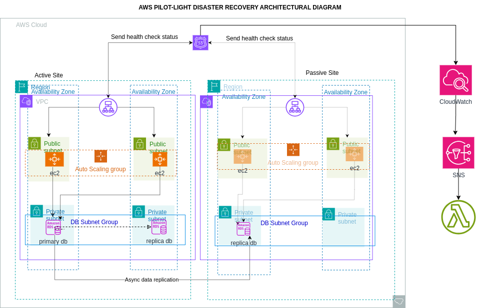

# 🛡️ AWS Pilot-Light Disaster Recovery Architecture

This project demonstrates a **Disaster Recovery (DR) solution** using the **Pilot-Light strategy** on AWS. The core idea is to maintain a minimal version of the production environment in a **secondary region**, and quickly scale up in case of a disaster or failure in the primary region.

---

## 📌 Architecture Overview

- **Active Region**: Hosts the full production environment.
  - EC2 instances behind an Auto Scaling Group
  - Amazon RDS (primary)
  - Amazon S3 (with cross-region replication)
  - Lambda functions
  - VPC with public/private subnets
- **Passive Region**: Hosts a minimal setup (Pilot Light)
  - EC2 instances (scaled-down or stopped)
  - Amazon RDS Read Replica (cross-region)
  - Lambda function (inactive unless failover)
  - Same VPC layout as primary region

---

## ⚙️ How Failover Works

Failover is **automated** using the following components:

- **CloudWatch Alarms** monitor the health of the primary site (e.g., EC2 instance status, HTTP health checks).
- **Route 53** health checks detect regional failures and automatically shift traffic to the secondary region.
- **SNS Topic** triggers a **Lambda function** when CloudWatch detects a failure.
- The **Lambda function**:
  - Promotes the **RDS read replica** in the passive region to a **primary**.
  - Scales up the **EC2 Auto Scaling Group** in the passive region using the AWS SDK (Boto3 or SDK for Node.js).

---

## 💻 Infrastructure as Code (Terraform)

This entire setup is automated using **Terraform** with a **modular approach**.

## Project Structure

- terraform/
  - modules/
    - vpc/
    - sg/
    - secrets/
    - ec2/
    - rds/
    - s3/
    - lambda/
  - primary/
    - main.tf
    - variables.tf
    - outputs.tf
  - secondary/
    - main.tf
    - variables.tf
    - outputs.tf

- **Modules** are reusable for both primary and secondary regions.
- **Primary region** hosts the full stack.
- **Secondary region** hosts a pilot-light stack (minimal resources).

---

## 🔁 Lambda Function Details

- **Trigger**: SNS Topic → Triggered by CloudWatch alarm.
- **Action**:
  - Promotes RDS Read Replica to primary using AWS SDK.
  - Scales up EC2 instances by modifying the Auto Scaling Group desired capacity.
- **Region**: Deployed in the passive region but inactive until triggered.
- **Environment Config**: Uses AWS Systems Manager Parameter Store to manage values cross-region.

---

## 🌐 Sample Application

- A simple web application was deployed on EC2 instances behind a Load Balancer.
- Verified to switch correctly between regions using Route 53 failover policy.

---

## ✅ Testing the DR Plan

To simulate a failure:

1. Terminate EC2 instances in the **primary region** or manually disable health checks.
2. Observe:
   - Route 53 switches traffic to **secondary region**.
   - Lambda promotes the RDS replica and scales EC2.
3. Application becomes available in the passive region.
4. Once primary is restored, DNS can be pointed back manually or through automation.

---

## 📂 Repository Structure

- `terraform/` - All Infrastructure as Code modules
- `disaster-recovery.png` - DR architecture diagram (at project root)
- `lambda/` - Code for Lambda failover function
- `README.md` - This documentation

---

## 🔗 Useful Resources

- [AWS Pilot Light DR Strategy](https://docs.aws.amazon.com/whitepapers/latest/disaster-recovery-workloads-on-aws/pilot-light.html)
- [Terraform AWS Provider](https://registry.terraform.io/providers/hashicorp/aws/latest/docs)
- [Boto3 RDS Promote Read Replica](https://boto3.amazonaws.com/v1/documentation/api/latest/reference/services/rds.html#RDS.Client.promote_read_replica)

---

## ✨ Author

**Michael Oppong**  
Cloud DevOps Engineer | AI Trainer | Software Developer  
_Ghana, 2025_

---

## ✅ Submission Instructions

- Ensure all Terraform and Lambda code is committed to GitHub.
- Include this `README.md` and the `disaster-recovery.png` in the root directory.
- Walk your mentor through:
  - Code
  - Failover trigger and recovery
  - Architecture
- Demo the failover event live (or via a video screen share if remote).

---

## 🔐 Disclaimer

This solution is for educational and proof-of-concept purposes. Ensure you adapt the failover process and data replication to meet your organization's security and compliance policies.
